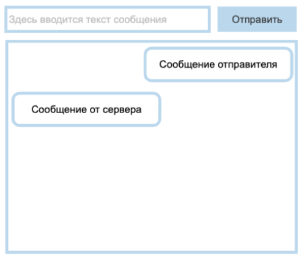
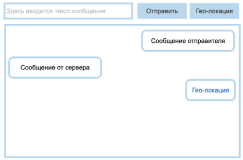

# Задание №1.

Сверстайте кнопку, которая будет содержать в себе [icon_01](https://icons.getbootstrap.com/icons/arrow-down-left-circle/). При клике на кнопку иконка должна меняться на [icon_02](https://icons.getbootstrap.com/icons/arrow-down-left-circle-fill/). Повторный клик меняет иконку обратно.

# Задание №2.

Сверстайте кнопку, клик на которую будет выводить данные о размерах экрана с помощью [alert](https://developer.mozilla.org/ru/docs/Web/API/Window/alert). 

# Задание №3.

1. Реализовать чат на основе эхо-сервера _wss://echo-ws-service.herokuapp.com_.  
Интерфейс состоит из `input`, куда вводится текст сообщения, и кнопки «Отправить».  
При клике на кнопку «Отправить» сообщение должно появляться в окне переписки.  
Эхо-сервер будет отвечать вам тем же сообщением, его также необходимо выводить в чат:  
  

2. Добавить в чат механизм отправки геолокации:  
  
При клике на кнопку «Геолокация» необходимо отправить данные серверу и в чат вывести ссылку на [https://www.openstreetmap.org/](https://www.openstreetmap.org/) с вашей геолокацией. __Сообщение, которое отправит обратно эхо-сервер, не выводить__.

